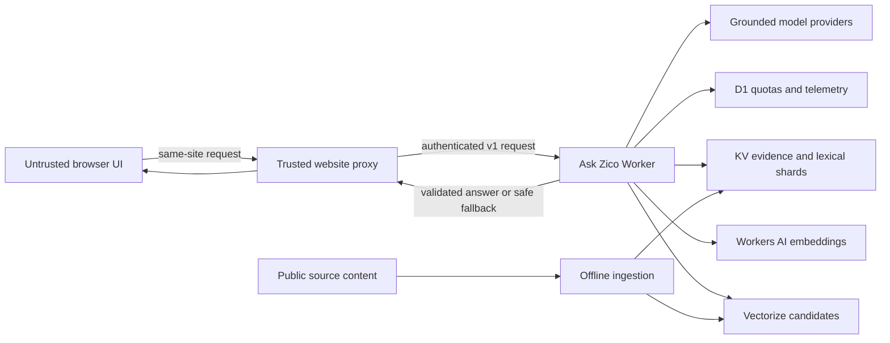

# Ask Zico

**Production-grade Arabic-first, citation-bound RAG on Cloudflare Workers.**

Ask Zico is the open-source reference implementation behind the assistant running on
[Madraset El Shamamsa](https://madraset-elshamamsa.com/ask-zico.php). It combines
controlled hybrid retrieval, stable evidence identities, citation validation, quota-aware
provider routing, conservative fallbacks, and privacy-aware observability.

[Try the live assistant](https://madraset-elshamamsa.com/ask-zico.php) ·
[Read the engineering case study](https://emad-ashraf.vercel.app/projects/ask-zico) ·
[View the stable v1.0.0 release](https://github.com/madraset-elshamamsa/ask-zico/releases/tag/v1.0.0)

## Why this project is interesting

- **Evidence stays authoritative.** Retrieval returns application-owned `chunk_id` values,
  the Worker hydrates the original text, and generated citations must resolve to the
  retrieved evidence set.
- **Failures are designed, not hidden.** Unsupported questions, retrieval failures, invalid
  model output, provider exhaustion, and telemetry failures each have explicit behavior.
- **The browser is outside the trust boundary.** A server-side proxy owns authentication,
  privacy-preserving quota identities, abuse controls, and the private Worker credential.
- **Provider fallback preserves the evidence contract.** A Gemini model ladder and a
  qualifying OpenRouter fallback share the same structured answer and citation validation.
- **The integration is versioned and testable.** The stable API includes OpenAPI
  documentation, executable fixtures, a deterministic local stub, and a release pinning
  procedure for consumers.

The `v1.0.0` release runs in production and passed 204 automated contract, ingestion,
encoding, retrieval, policy, quota, provider-routing, feedback, and Worker tests.

## Production architecture



The Worker is the single owner of normalization, routing, retrieval, evidence hydration,
quota reservations, provider selection, citation validation, and fallback behavior. The
consumer owns its browser UI, user/session controls, server-side proxy, and reviewed Ask
Zico release pin. See [the architecture notes](docs/architecture.md) and the
[production architecture case study](https://emad-ashraf.vercel.app/articles/ask-zico/01-idea-demo-architecture-and-website-integration)
for the deeper request lifecycle and design rationale.

## Reliability and security invariants

- Browsers never receive or use the private Worker caller token.
- Production corpus data, visitor data, credentials, account identifiers, and operational
  configuration are not stored in this repository.
- Model output is accepted only after schema validation and citation-ID allow-listing.
- Provider fallback is reserved for qualifying capacity or provider-layer failures; it does
  not retry an answer that lacks supporting evidence.
- D1 quota reservations are atomic, while bounded telemetry failures do not block the
  already-selected user response.
- CI runs the full test suite, OpenAPI linting, TypeScript checking, sample ingestion, and a
  Wrangler deployment dry-run without holding production credentials or deploying.

Security issues should be reported privately as described in [SECURITY.md](SECURITY.md).

## Reusable core and Ask Zico profile

This repository is a production reference implementation, not a turnkey universal chatbot.

| Reusable architecture | Product-specific profile |
| --- | --- |
| Trusted proxy and stable API contract | Arabic/Coptic aliases and normalization choices |
| Stable evidence IDs and citation validation | Domain router and response policy |
| Hybrid retrieval and evidence hydration | Corpus schema and supported libraries |
| Atomic quotas, feedback, and observability | Provider ladder, limits, and fallback thresholds |
| Contract fixtures, local stub, and ingestion tools | Madraset El Shamamsa integration and UX |

Forks should preserve the security and grounding invariants while deliberately replacing
the domain-specific profile. Ask Zico and Madraset El Shamamsa branding is not licensed
under MIT; see [BRANDING.md](BRANDING.md) and [NOTICE.md](NOTICE.md).

## What is included

- A TypeScript Cloudflare Worker and D1 migrations.
- Executable Worker, contract, encoding, and ingestion tests.
- Corpus ingestion, KV preparation, Vectorize preparation, and evaluation tools.
- A small original Arabic sample corpus that can be generated without private paths.
- A public OpenAPI contract, deterministic local stub, and protected PHP proxy example.

## Quick start

Requirements: Node.js 22+ and npm.

```powershell
npm ci
npm ci --prefix worker
npm test
npm run lint:contract
npm run typecheck
npm run ingest:sample
```

The final command writes generated sample artifacts under `.local/assistant-ingest/`. The
sample demonstrates corpus preparation. A hosted response path additionally requires your
own Cloudflare account, KV, D1, Vectorize/Workers AI bindings, caller tokens, corpus, and
optional model-provider keys. Start from `worker/wrangler.example.jsonc`; never copy a
production configuration.

To exercise an integration without Cloudflare or provider credentials, run the deterministic
contract stub:

```powershell
$env:ASK_ZICO_STUB_PROXY_TOKEN = "local-contract-token"
npm run stub:contract
```

Then point a trusted application proxy at `http://127.0.0.1:8790` with the same token. See
[the integration guide](docs/integration.md) and `examples/php-proxy/` for the boundary and
upgrade procedure.

## Documentation

- [Architecture](docs/architecture.md) — ownership and trust boundaries.
- [Integration](docs/integration.md) — contract stub, proxy responsibilities, and upgrades.
- [Deployment](docs/deployment.md) — reviewed manual deployment and verification.
- [Operations](docs/operations.md) — migrations, health checks, rollback, and observability.
- [Release readiness](docs/releasing.md) — release, security, and publication checklist.
- [OpenAPI contract](contract/openapi.yaml) — stable v1 HTTP interface.
- [Changelog](CHANGELOG.md) — released changes.

Focused issues and pull requests are welcome under [CONTRIBUTING.md](CONTRIBUTING.md) and
the [Code of Conduct](CODE_OF_CONDUCT.md).

## License

Code is licensed under the [MIT License](LICENSE). The original sample corpus under
`examples/sample-corpus/` has separate [CC BY 4.0 terms](examples/sample-corpus/LICENSE.md).
Third-party dependencies retain their own licenses.
